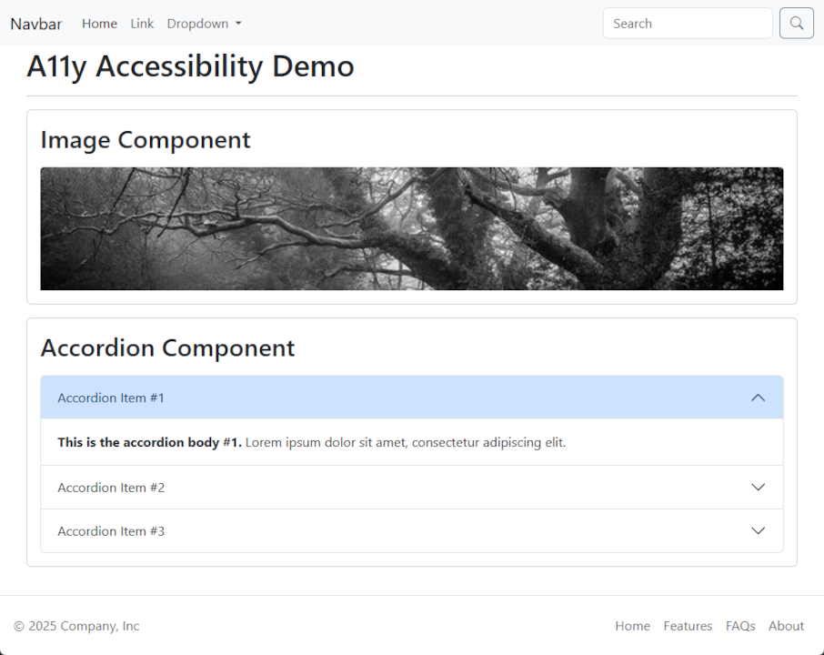
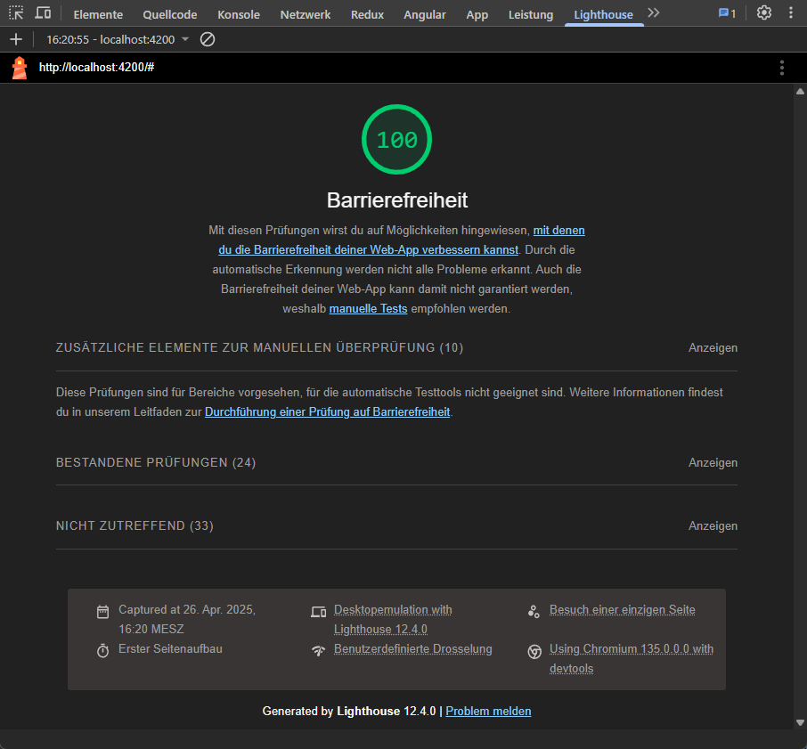

# A11y Accessibility Demo ♿

Diese Demo zeigt, wie man einfache UI-Boostrap-Komponenten wie ein **Accordion** und 
ein **Bild** nach den **A11y-Standards** (Accessibility) umsetzt. 
Das Projekt veranschaulicht, wie Barrierefreiheit bereits in 
kleinen Angular-Anwendungen berücksichtigt werden kann.


## 🛠️ Verwendete Technologien

- **Angular 19**
- **Bootstrap 5** (für Accordion-Layout)
- **Lighthouse** (Chrome DevTools) – für A11y-Analyse
- **axe DevTools** (Browser-Plugin) – für detaillierte Accessibility-Checks

## ✨ Features

- **Accordion** mit korrekten ARIA-Attributen
- **Bild** mit sinnvoller `alt`-Beschreibung
- Fokus-Management für Tastaturnavigation
- Optimiert für Screenreader-Nutzung
- Überprüfbar mit **Lighthouse** und **axe DevTools**


## 🖥️ Screenreader aktivieren

```
Windows: Windows + Strg + Eingabetaste (Narrator)
Mac:     Cmd + F5 (VoiceOver)
Linux:   Alt + Super + S (Orca Screen Reader) 
```

> **Hinweis:** Bei manchen Systemen muss der Screenreader vorher installiert oder aktiviert werden.


## 📋 Aufbau & Inhalte

### Accordion

- Jedes Accordion-Element ist mit den richtigen `aria-expanded` und `aria-controls` versehen.
- Fokusreihenfolge und Tastaturnavigation werden eingehalten.

### Bild

- Jedes Bild hat ein sinnvolles `alt`-Attribut, damit Screenreader den Inhalt korrekt beschreiben können.


## 🧪 A11y-Prüfung

Zur Überprüfung der Barrierefreiheit kannst du folgende Tools nutzen:

### Lighthouse (Chrome DevTools)

1. Öffne die Anwendung im Browser.
2. Öffne die **Chrome DevTools** (`F12` oder `Strg+Shift+I`).
3. Gehe zum Reiter **Lighthouse**.
4. Wähle den Bereich **Accessibility** aus.
5. Starte den Scan und analysiere die Ergebnisse.

### axe DevTools

1. Installiere die **axe DevTools** Erweiterung für deinen Browser.
2. Öffne die Anwendung und die **axe**-Erweiterung.
3. Führe einen Accessibility-Check durch und befolge Verbesserungsvorschläge.


## 🚀 Lokales Setup

```
git clone https://github.com/ronnymundt/a11y-accessibility-demo.git
cd a11y-accessibility-demo
npm install
ng serve
```


## 📸 Screenshots




## 📚 Ressourcen

- [Web Content Accessibility Guidelines (WCAG)](https://www.w3.org/WAI/standards-guidelines/wcag/)
- [Angular Accessibility Guide](https://angular.io/guide/accessibility)
- [Bootstrap 5 Accessibility](https://getbootstrap.com/docs/5.0/getting-started/accessibility/)
- [axe DevTools](https://www.deque.com/axe/devtools/)


Viel Spass beim Erkunden von A11y in Angular! 🌟
